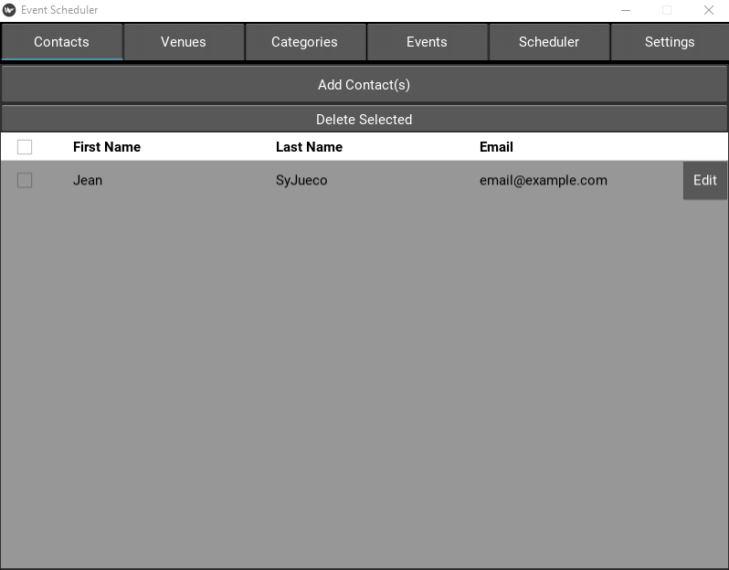

# Event Scheduler #

Event Scheduler is a workshop management application created for the _Arts Instructional Support and Information Technology_ unit at the _University of British Columbia_. By leveraging Exchange Web Services (EWS) and the iCalendar data format, Event Scheduler helps streamline the booking and creation of workshops on Microsoft Outlook and WordPress. All of this is performed through an easy-to-use user interface, which allows for the adding of attendees, a room list, workshop categories and workshop types.

### Requires ###

* [kivy](https://github.com/kivy/kivy)
* [KivyCalendar](https://pypi.org/project/KivyCalendar/)
* [ics](https://pypi.org/project/ics/)
* [exchangelib](https://pypi.org/project/exchangelib/)

### Features ###

* **Contacts**:
  * Add, delete and edit contacts
* **Venues**:
  * Add, delete and edit venues
* **Categories**:
  * Add, delete and edit workshop categories
* **Events**:
  * Add, delete and edit workshop types
* **Scheduler**:
  * Schedule and cancel workshops on Microsoft Outlook via EWS
  * Export an iCalendar and JSON file for use with [Event Organiser](https://github.com/stephenharris/Event-Organiser/blob/develop/readme.md)
* **Settings**:
  * Change the server at which a user connects to
  * Change the shared mailbox at which a user connects to
  * Change the directory at which the iCalendar and JSON files are exported to
  * Bypass the scheduling of workshops on Microsoft Outlook and export them only

## Demo ##

